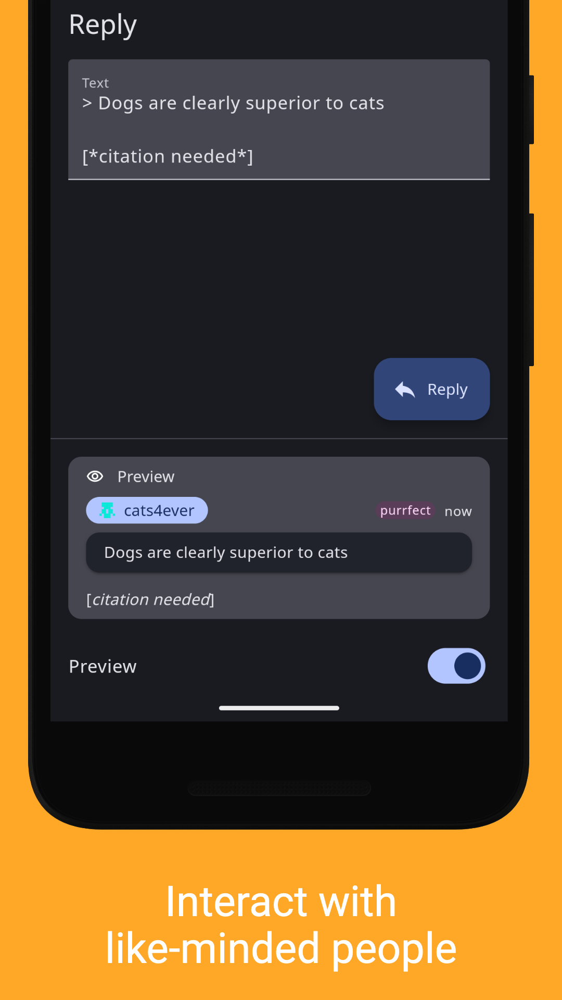

# Glider for Hacker News

[][play store]
[][f-droid]

Glider is an opinionated Hacker News client. Ad-free, open-source, no-nonsense.

- Browse stories, comments and user profiles
- Catch up on and search stories from any period
- Log in using an existing or new Hacker News account
- Vote on and favorite stories and comments
- Write replies and submit new stories
- Collapse comment trees
- No ads, no telemetry
- Extensive theming
- Sensible defaults

  
  
  
  
  

[play store]: https://play.google.com/store/apps/details?id=nl.viter.glider
[f-droid]: https://f-droid.org/packages/nl.viter.glider
