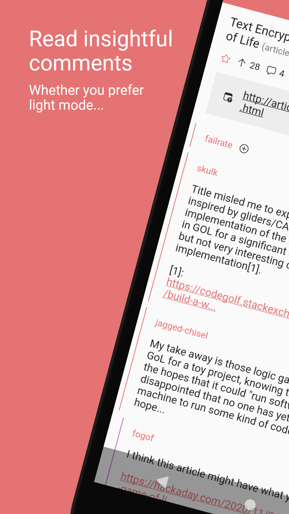
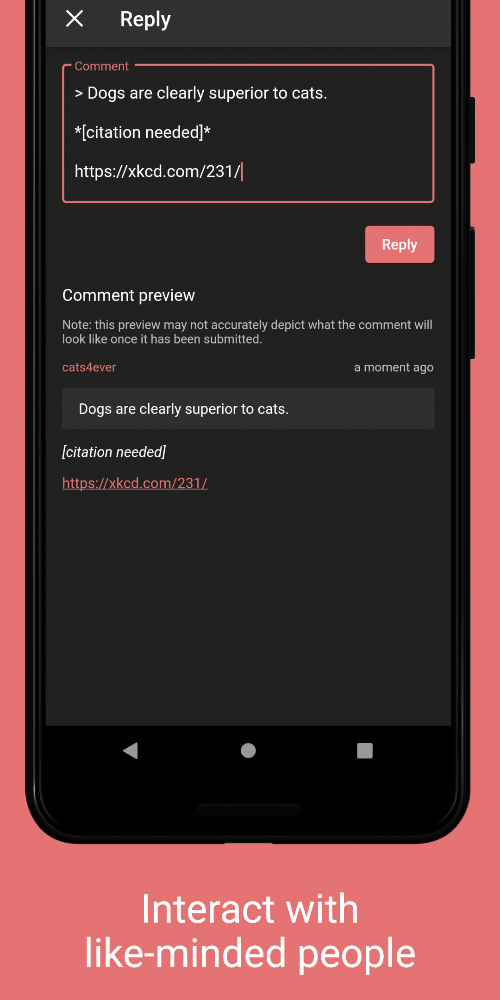

# Glider for Hacker News

[![Get it on Google Play][play store badge]][play store]

Glider is an opinionated Hacker News client. Ad-free, open-source, no-nonsense.

- Browse stories, comments and user profiles
- Log in using an existing or new Hacker News account
- Vote on and favorite stories and comments
- Write replies and submit new stories (experimental)
- Collapse comment trees
- No ads, no telemetry
- Automatic theming
- Sensible defaults

<p>
  
  
  
  
</p>

## Development

Glider is built with the latest beta version of Flutter. Code that can be generated is not included in the repository. Generate it by running `build_runner`:

```sh
flutter pub run build_runner build --delete-conflicting-outputs
```

[play store]: https://play.google.com/store/apps/details?id=nl.viter.glider
[play store badge]: https://play.google.com/intl/en_us/badges/images/badge_new.png
